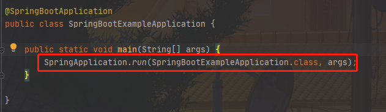
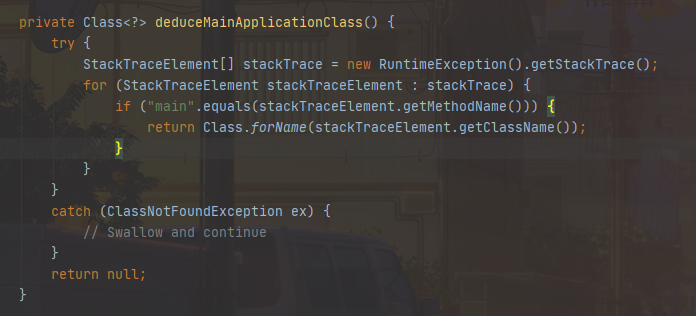
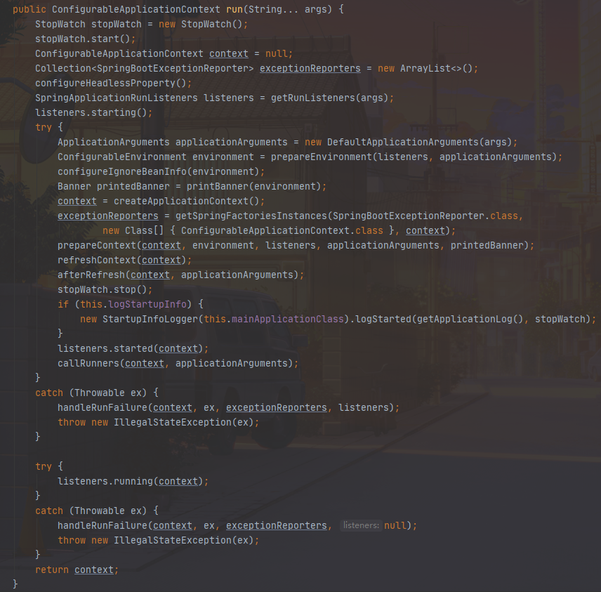
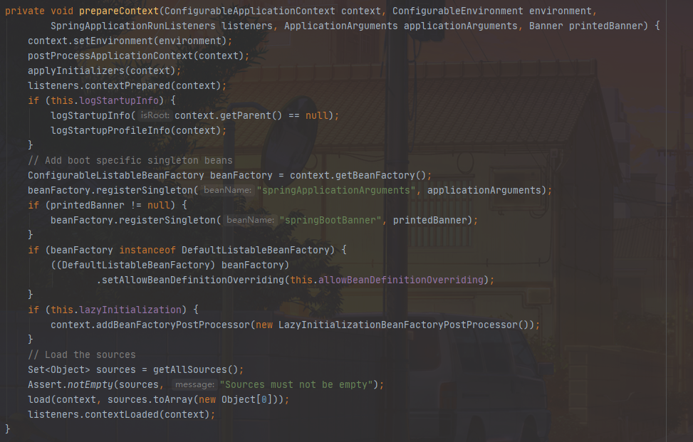
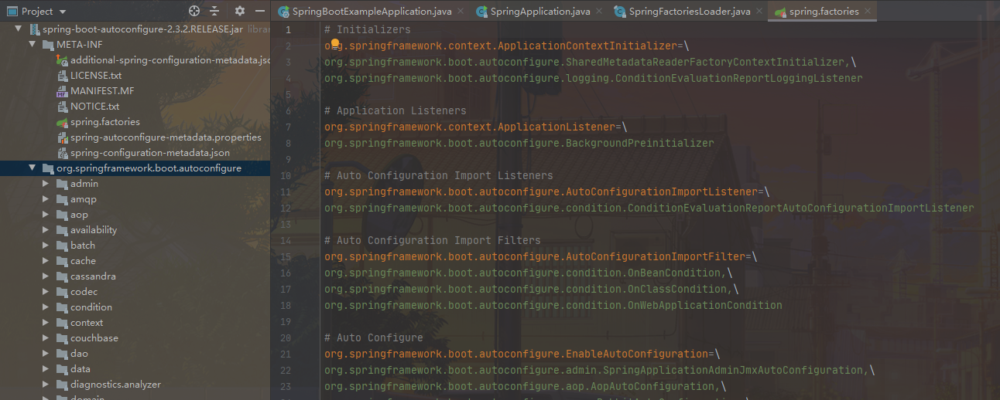
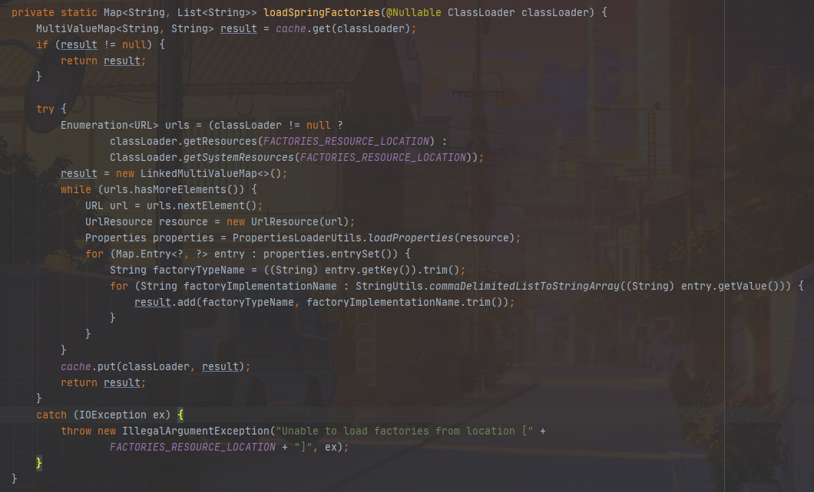
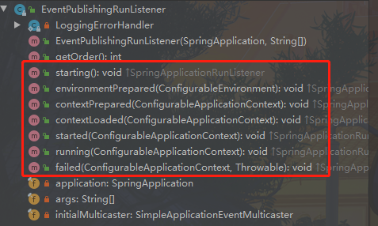

# Spring Boot 源码解析 (版本2.3.x)

## 启动原理分析

> Main方法启动

### SpringApplication构造方法 

* primarySources : 加载的主要资源类
* webApplicationType : Web应用类型(REACTIVE/NONE/SERVLET)，默认Servlet
* 根据 [Spring SPI机制](#SpringFactoriesLoader) 实例化ApplicationContextInitializer、ApplicationListener
* mainApplicationClass : 获取当前main方法

> deduceMainApplicationClass方法根据新建RuntimeException，获取当前堆栈，遍历该堆栈查找main方法，很新颖的写法

### run方法解析

* StopWatch用于记录启动信息，包括启动耗时，用于日志输出
* configureHeadlessProperty 设置Headless模式
* prepareEnvironment 准备环境
  * getOrCreateEnvironment 默认类型StandardServletEnvironment，获取jvm环境变量、系统环境变量，Servlet参数等
  * configureEnvironment 将Profiles、Arguments(启动参数)、ConversionService(类型转换，初始136个)设置到Spring运行环境
  * ConfigurationPropertySources.attach [ConfigurationPropertySources](#ConfigurationPropertySources)
  * listeners.environmentPrepared 将 [application.properties](#ConfigFileApplicationListener) 加载到Environment中
  * bindToSpringApplication 将属性[绑定](#Binder) SpringApplication ，如spring.main.allow-bean-definition-overriding绑定到allowBeanDefinitionOverriding变量
* configureIgnoreBeanInfo 设置是否跳过对BeanInfo类的搜索 , [详见CachedIntrospectionResults](https://docs.spring.io/spring/docs/5.0.0.RC3/javadoc-api/org/springframework/beans/CachedIntrospectionResults.html)
* printBanner 打印启动图标(公司logo)
* createApplicationContext 根据前面的webApplicationType创建上下文，默认AnnotationConfigServletWebServerApplicationContext
* 初始化异常报告输出[SpringBootExceptionReporter](#SpringBootExceptionReporter) 
* [prepareContext](#prepareContext) 准备上下文(核心方法)
* [refreshContext](#refreshContext) 刷新上下文(核心方法)
* afterRefresh 默认空实现
* listeners.started 触发started事件，默认触发[EventPublishingRunListener](#EventPublishingRunListener)
* callRunners 扩展点之一，用于工程启动完成之后执行的

### prepareContext

* context.setEnvironment 设置上下文环境
* postProcessApplicationContext 
* applyInitializers 调用 [ApplicationContextInitializer](#ApplicationContextInitializer)
* listeners.contextPrepared 触发 [ApplicationContextInitializedEvent](#EventPublishingRunListener)
* 将applicationArguments注册为spring Bean实例，应用可以通过实例名springApplicationArguments获取
* 将printedBanner注册为Spring Bean实例， 应用可以通过实例名springBootBanner获取
* 设置allowBeanDefinitionOverriding，若设置为true则允许同名实例进行覆盖，由spring.main.allow-bean-definition-overriding进行设置
* lazyInitialization 是否延迟初始化
* load 通过 [BeanDefinitionLoader](#BeanDefinitionLoader) 扫描Bean
* listeners.contextLoaded 触发 [ApplicationPreparedEvent](#EventPublishingRunListener)

### refreshContext

### SpringFactoriesLoader

> ps: 对于不清楚什么是SPI机制的可自行百度 "JAVA SPI"

Spring SPI配置文件位于类路径下的META-INF/spring.factories

> 相比于jdk自带的ServiceLoader，或者Dubbo的ExtensionLoader，整个SpringFactoriesLoader对于SPI的实现就显得十分轻量、清晰，主要也就一个loadSpringFactories方法，主要逻辑也就是读取spring.factories里面的配置，然后通过类路径实例化类

### ConfigurationPropertySources

### SpringBootExceptionReporter

### EventPublishingRunListener

初始化时，获取从SpringApplication中传过来的ApplicationListener，生命周期各个阶段通过广播方式进行事件触发

> Spring Boot自带ApplicationListener如下:
* org.springframework.boot.ClearCachesApplicationListener
* org.springframework.boot.builder.ParentContextCloserApplicationListener
* org.springframework.boot.cloud.CloudFoundryVcapEnvironmentPostProcessor
* org.springframework.boot.context.FileEncodingApplicationListener
* org.springframework.boot.context.config.AnsiOutputApplicationListener
* org.springframework.boot.context.config.ConfigFileApplicationListener
* org.springframework.boot.context.config.DelegatingApplicationListener
* org.springframework.boot.context.logging.ClasspathLoggingApplicationListener
* org.springframework.boot.context.logging.LoggingApplicationListener
* org.springframework.boot.liquibase.LiquibaseServiceLocatorApplicationListener
* org.springframework.boot.autoconfigure.BackgroundPreinitializer

> Spring整个生命周期节点与事件关系如下:
* starting :  ApplicationStartingEvent
* environmentPrepared : ApplicationEnvironmentPreparedEvent
* contextPrepared : ApplicationContextInitializedEvent
* contextLoaded : ApplicationPreparedEvent
* started : ApplicationStartedEvent
* running : ApplicationReadyEvent
* failed : ApplicationFailedEvent

> Spring整个生命周期触发时间节点关系如下:
* starting :  SpringApplication.run方法体中的listeners.starting触发，此时Spring刚启动
* environmentPrepared : SpringApplication.prepareEnvironment方法体中的listeners.environmentPrepared触发，此时环境准备完成
* contextPrepared : SpringApplication.prepareContext方法体中的listeners.contextPrepared触发，此时上下文准备工作完成
* contextLoaded : SpringApplication.prepareContext方法体中的listeners.contextLoaded触发，此时上下文加载工作完成
* started : SpringApplication.run方法体中的listeners.started触发，此时Spring上下文已经刷新完成
* running : SpringApplication.run方法体中的listeners.running触发，此时整个应用启动完成
* failed : SpringApplication.handleRunFailure方法体中的listeners.failed触发，此时启动失败

> Spring整个生命周期触发ApplicationListener关系如下:  

| 方法 | 事件 | ApplicationListener |
| :----: | :----: | :----: |
| starting | ApplicationStartingEvent | LoggingApplicationListener、LiquibaseServiceLocatorApplicationListener、BackgroundPreinitializer |
| environmentPrepared | ApplicationEnvironmentPreparedEvent | FileEncodingApplicationListener、AnsiOutputApplicationListener、[ConfigFileApplicationListener](#ConfigFileApplicationListener)、DelegatingApplicationListener、ClasspathLoggingApplicationListener、LoggingApplicationListener |
| contextPrepared | ApplicationContextInitializedEvent | - |
| contextLoaded | ApplicationPreparedEvent | CloudFoundryVcapEnvironmentPostProcessor、ConfigFileApplicationListener、LoggingApplicationListener |
| started | ApplicationStartedEvent | - |
| running | ApplicationReadyEvent | BackgroundPreinitializer |
| failed | ApplicationFailedEvent | ClasspathLoggingApplicationListener、LoggingApplicationListener、BackgroundPreinitializer |

### ConfigFileApplicationListener

121

### ApplicationContextInitializer

> Spring Boot自带的实现如下:  
* org.springframework.boot.context.config.DelegatingApplicationContextInitializer 
* org.springframework.boot.autoconfigure.SharedMetadataReaderFactoryContextInitializer 
* org.springframework.boot.context.ContextIdApplicationContextInitializer
* org.springframework.boot.context.ConfigurationWarningsApplicationContextInitializer
* org.springframework.boot.rsocket.context.RSocketPortInfoApplicationContextInitializer
* org.springframework.boot.web.context.ServerPortInfoApplicationContextInitializer
* org.springframework.boot.autoconfigure.logging.ConditionEvaluationReportLoggingListener

### BeanDefinitionLoader

### Binder