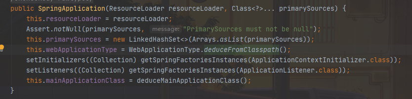
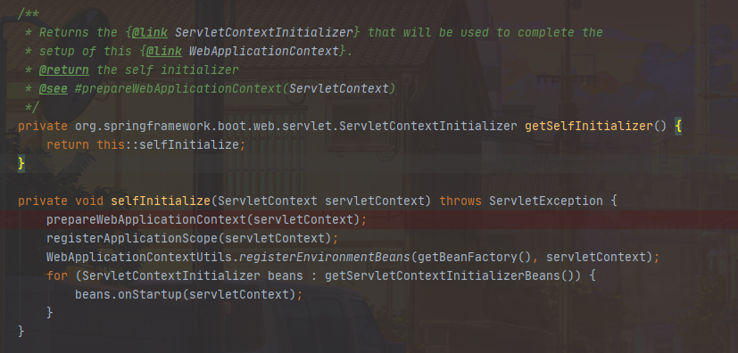

# Spring Boot 源码解析 (版本2.3.x)

阅读指南: 通篇文章使用先总后分的形式，读者可以根据里面的链接跳转到对应章节阅读具体内容。

## 启动原理分析

> Main方法启动


### SpringApplication构造方法 



* primarySources : 加载的主要资源类
* webApplicationType : Web应用类型(REACTIVE/NONE/SERVLET)，默认Servlet
* 根据 [Spring SPI机制](#SpringFactoriesLoader) 实例化ApplicationContextInitializer、ApplicationListener
* mainApplicationClass : 获取当前main方法

> deduceMainApplicationClass方法根据新建RuntimeException，获取当前堆栈，遍历该堆栈查找main方法，很新颖的写法


### run方法解析


* StopWatch用于记录启动信息，包括启动耗时，用于日志输出
* configureHeadlessProperty 设置Headless模式
* prepareEnvironment 准备环境
  * getOrCreateEnvironment 默认类型StandardServletEnvironment，获取jvm环境变量、系统环境变量，Servlet参数等
  * configureEnvironment 将Profiles、Arguments(启动参数)、ConversionService(类型转换，初始136个)设置到Spring运行环境
  * ConfigurationPropertySources.attach [ConfigurationPropertySources](#ConfigurationPropertySources)
  * listeners.environmentPrepared 将 [application.properties](#ConfigFileApplicationListener) 加载到Environment中
  * bindToSpringApplication 将属性[绑定](#Binder) SpringApplication ，如spring.main.allow-bean-definition-overriding绑定到allowBeanDefinitionOverriding变量
* configureIgnoreBeanInfo 设置是否跳过对BeanInfo类的搜索 , [详见CachedIntrospectionResults](https://docs.spring.io/spring/docs/5.0.0.RC3/javadoc-api/org/springframework/beans/CachedIntrospectionResults.html)
* printBanner 打印启动图标(公司logo)
* createApplicationContext 根据前面的webApplicationType创建上下文，默认AnnotationConfigServletWebServerApplicationContext
* 初始化异常报告输出[SpringBootExceptionReporter](#SpringBootExceptionReporter) 
* [prepareContext](#prepareContext) 准备上下文(<font color=#F08080 size=5>核心方法</font>)
* [refreshContext](#refreshContext) 刷新上下文(<font color=#F08080 size=5>核心方法</font>)
* afterRefresh 默认空实现
* listeners.started 触发started事件，默认触发[EventPublishingRunListener](#EventPublishingRunListener)
* callRunners 扩展点之一，用于工程启动完成之后执行的

### SpringFactoriesLoader

> ps: 对于不清楚什么是SPI机制的可自行百度 "JAVA SPI"

Spring SPI配置文件位于类路径下的META-INF/spring.factories


> 相比于jdk自带的ServiceLoader，或者Dubbo的ExtensionLoader，整个SpringFactoriesLoader对于SPI的实现就显得十分轻量、清晰，主要也就一个loadSpringFactories方法，主要逻辑也就是读取spring.factories里面的配置，然后通过类路径实例化类


### ConfigurationPropertySources

TODO

### ConfigFileApplicationListener

实现配置文件加载，Profile属性加载等。


默认的EnvironmentPostProcessor包括: 执行顺序为 ↓  
* SystemEnvironmentPropertySourceEnvironmentPostProcessor 封装systemEnvironment为OriginAwareSystemEnvironmentPropertySource，用于程序异常报错时，定位报错属性。详细可参考TextResourceOrigin、PropertySourceOrigin、OriginTrackedPropertiesLoader等。
* SpringApplicationJsonEnvironmentPostProcessor jvm启动参数设置spring.application.json传json格式配置，或者环境变量添加SPRING_APPLICATION_JSON来设置spring boot配置
* CloudFoundryVcapEnvironmentPostProcessor 运行环境为 [Cloud Foundry](https://www.cloudfoundry.org/)(开源PaaS私有云平台) 时相关配置
* ConfigFileApplicationListener(自身)
* DebugAgentEnvironmentPostProcessor 响应式模式调试代理层，默认如果找到reactor.tools.agent.ReactorDebugAgent则开启，可以通过设置spring.reactor.debug-agent.enabled为false进行关闭

通过addPropertySources方法创建Loader实例并调用load方法(<font color=#F08080 size=5>核心方法</font>)  


* FilteredPropertySource.apply //TODO 暂时还没完全理解用处。。。
* initializeProfiles 初始化Profile
* load 根据 规则 查找加载配置文件， 规则如下: 
  * classpath:/ 类路径
  * classpath:/config/ 类路径下的config文件夹
  * file:./ jar包所在目录
  * file:./config/*/ jar包所在路径下的config文件夹
  * file:./config/ jar包所在路径下的config文件夹

> 配置相关属性:  
* spring.config.additional-location 可增加额外配置路径，比如除了想加载默认application.properties，还想加载自定义的properties则可以通过设置该参数进行扩展
* spring.config.location 若上面的读取规则无法满足需要，则可以自行定义读取规则，比如外置配置文件实现配置分离
* spring.config.name 自定义配置文件名，比如读取module.properties则配置为module，若想配置多个则用","分隔

> 关于jdk1.8 lambda写法

```
load(profile, this::getPositiveProfileFilter, addToLoaded(MutablePropertySources::addLast, false));
load(null, this::getNegativeProfileFilter, addToLoaded(MutablePropertySources::addFirst, true));

private void load(Profile profile, DocumentFilterFactory filterFactory, DocumentConsumer consumer) {
	// do something...
}
private DocumentFilter getPositiveProfileFilter(Profile profile) {
	// do something
}
private DocumentFilter getNegativeProfileFilter(Profile profile) {
	// do something
}
```
> 一开始对于这种写法还是比较迷惑，load的第二个参数明明是需要传入DocumentFilterFactory类型参数，而getPositiveProfileFilter及getNegativeProfileFilter都是返回的DocumentFilter，怎么传得进去?  

> 解答: 
```
@FunctionalInterface
private interface DocumentFilterFactory {
	DocumentFilter getDocumentFilter(Profile profile);
}
```
DocumentFilterFactory只有一个getDocumentFilter接口，而这个接口的构造跟而getPositiveProfileFilter及getNegativeProfileFilter是一样的，所以这里的this::getPositiveProfileFilter，this::getNegativeProfileFilter实际就是将这两个方法当成一个匿名DocumentFilterFactory实现类传进去，
有点像javascript中的回调函数。
```
//定义回调方法
var callback = function() {
//do something
}
//调用回调方法
var doCall = function(callback) {
	callback = callback || function(){};
	callback();
}
//将回调方法当成参数传进去
doCall(callback);
```

> 关于BiConsumer用法

问题描述: addToLoaded(MutablePropertySources::addLast, false)方法体中使用addMethod.accept(merged, document.getPropertySource());调用MutablePropertySources::addLast方法，但是accept需要传参两个，而addLast只需要传一个参数，这是为啥？？？  

> 解答: 看如下例子，如注释中说的 "虽然addLast方法只接受一个参数，而BiConsumer.accept接受两个参数，第一个参数为MyConsumer实例，第二个参数为实际入参，即等价为myConsumer.addLast(54)"

```
import java.util.ArrayList;
import java.util.List;
import java.util.function.BiConsumer;

public class MyConsumer {

    private List<Integer> list = new ArrayList<>();

    public MyConsumer() {}

    public MyConsumer(List<Integer> list) {
        this.list = list;
    }

    public void addLast(int i) {
        list.add(i);
    }

    public List<Integer> getList() {
        return list;
    }

    public void setList(List<Integer> list) {
        this.list = list;
    }

    public static void main(String[] args) {
        BiConsumer<MyConsumer, Integer> biConsumer = MyConsumer::addLast;

        MyConsumer myConsumer = new MyConsumer();
        myConsumer.addLast(1);
        System.out.println(myConsumer.getList());  //输出[1]
        biConsumer.accept(myConsumer, 54); //虽然addLast方法只接受一个参数，而BiConsumer.accept接受两个参数，第一个参数为MyConsumer实例，第二个参数为实际入参，即等价为myConsumer.addLast(54)
        System.out.println(myConsumer.getList()); //输出[1, 54]
    }
}
```

### Binder

Spring Boot 2.x新的属性绑定方式。

```
DemoProperties properties = Binder.get(environment).bind("demo", Bindable.of(DemoProperties.class)).get();

```
application.properties配置  
```
demo.count=10000
demo.name=test
```
Bindable使用详解
```
Bindable.ofInstance(T instance) //将属性配置设置到当前实例(instance)中
Bindable.of(Class<T> type) //将属性配置到type类型实例中，通过get方法获取该实例
Bindable.listOf(Class<E> elementType) //将属性配置设置到list中，通过get方法获取该list
Bindable.setOf(Class<E> elementType) //将属性配置设置到set中，通过get方法获取该set
Bindable.mapOf(Class<K> keyType, Class<V> valueType) //将属性配置设置到map中，通过get方法获取该map
Bindable.of(ResolvableType type) 
```
> 属性绑定的大体逻辑: 先根据属性名去environment中查找对应的属性，若找不到则通过遍历迭代的方式，去查找所有的属性并拼接出合适的属性名到environment中进行查找，若找到则设置到对应变量中。详细可查看Binder.bindDataObject方法。

### SpringBootExceptionReporter

org.springframework.boot.autoconfigure.data.redis.RedisUrlSyntaxFailureAnalyzer
org.springframework.boot.autoconfigure.diagnostics.analyzer.NoSuchBeanDefinitionFailureAnalyzer
org.springframework.boot.autoconfigure.flyway.FlywayMigrationScriptMissingFailureAnalyzer
org.springframework.boot.autoconfigure.jdbc.DataSourceBeanCreationFailureAnalyzer
org.springframework.boot.autoconfigure.jdbc.HikariDriverConfigurationFailureAnalyzer
org.springframework.boot.autoconfigure.r2dbc.ConnectionFactoryBeanCreationFailureAnalyzer
org.springframework.boot.autoconfigure.session.NonUniqueSessionRepositoryFailureAnalyzer

### prepareContext


* context.setEnvironment 设置上下文环境
* postProcessApplicationContext 
* applyInitializers 调用 [ApplicationContextInitializer](#ApplicationContextInitializer)
* listeners.contextPrepared 触发 [ApplicationContextInitializedEvent](#EventPublishingRunListener)
* 将applicationArguments注册为spring Bean实例，应用可以通过实例名springApplicationArguments获取
* 将printedBanner注册为Spring Bean实例， 应用可以通过实例名springBootBanner获取
* 设置allowBeanDefinitionOverriding，若设置为true则允许同名实例进行覆盖，由spring.main.allow-bean-definition-overriding进行设置
* lazyInitialization 是否延迟初始化
* load 通过 BeanDefinitionLoader 将从外部传进来的primarySources注册为Spring Bean
* listeners.contextLoaded 触发 [ApplicationPreparedEvent](#EventPublishingRunListener)

### refreshContext

> refreshContext 与传统通过xml配置spring一样都是通过调用AbstractApplicationContext中的refresh方法启动ApplicationContext，所以refreshContext实际就是将启动托付给 [Spring](spring.md) 进行。


这里重点看onRefresh方法，由 [AnnotationConfigServletWebServerApplicationContext](#AnnotationConfigServletWebServerApplicationContext) 重写，通过createWebServer实现内嵌web容器创建，这也是为什么spring boot可以不用部署在外边容器，而可以直接以jar包形式运行。

详情点击 [AnnotationConfigServletWebServerApplicationContext](#AnnotationConfigServletWebServerApplicationContext)

### ApplicationContextInitializer

> Spring Boot自带的实现如下:  
* org.springframework.boot.context.config.DelegatingApplicationContextInitializer 
* org.springframework.boot.autoconfigure.SharedMetadataReaderFactoryContextInitializer 
* org.springframework.boot.context.ContextIdApplicationContextInitializer
* org.springframework.boot.context.ConfigurationWarningsApplicationContextInitializer
* org.springframework.boot.rsocket.context.RSocketPortInfoApplicationContextInitializer
* org.springframework.boot.web.context.ServerPortInfoApplicationContextInitializer
* org.springframework.boot.autoconfigure.logging.ConditionEvaluationReportLoggingListener

### EventPublishingRunListener

初始化时，获取从SpringApplication中传过来的ApplicationListener，生命周期各个阶段通过广播方式进行事件触发

> Spring Boot自带ApplicationListener如下:
* org.springframework.boot.ClearCachesApplicationListener
* org.springframework.boot.builder.ParentContextCloserApplicationListener
* org.springframework.boot.cloud.CloudFoundryVcapEnvironmentPostProcessor
* org.springframework.boot.context.FileEncodingApplicationListener
* org.springframework.boot.context.config.AnsiOutputApplicationListener
* org.springframework.boot.context.config.ConfigFileApplicationListener
* org.springframework.boot.context.config.DelegatingApplicationListener
* org.springframework.boot.context.logging.ClasspathLoggingApplicationListener
* org.springframework.boot.context.logging.LoggingApplicationListener
* org.springframework.boot.liquibase.LiquibaseServiceLocatorApplicationListener
* org.springframework.boot.autoconfigure.BackgroundPreinitializer


> Spring整个生命周期节点与事件关系如下:
* starting :  ApplicationStartingEvent
* environmentPrepared : ApplicationEnvironmentPreparedEvent
* contextPrepared : ApplicationContextInitializedEvent
* contextLoaded : ApplicationPreparedEvent
* started : ApplicationStartedEvent
* running : ApplicationReadyEvent
* failed : ApplicationFailedEvent

> Spring整个生命周期触发时间节点关系如下:
* starting :  SpringApplication.run方法体中的listeners.starting触发，此时Spring刚启动
* environmentPrepared : SpringApplication.prepareEnvironment方法体中的listeners.environmentPrepared触发，此时环境准备完成
* contextPrepared : SpringApplication.prepareContext方法体中的listeners.contextPrepared触发，此时上下文准备工作完成
* contextLoaded : SpringApplication.prepareContext方法体中的listeners.contextLoaded触发，此时上下文加载工作完成
* started : SpringApplication.run方法体中的listeners.started触发，此时Spring上下文已经刷新完成
* running : SpringApplication.run方法体中的listeners.running触发，此时整个应用启动完成
* failed : SpringApplication.handleRunFailure方法体中的listeners.failed触发，此时启动失败

> Spring整个生命周期触发ApplicationListener关系如下:  

| 方法 | 事件 | ApplicationListener |
| :----: | :----: | :----: |
| starting | ApplicationStartingEvent | LoggingApplicationListener、LiquibaseServiceLocatorApplicationListener、BackgroundPreinitializer |
| environmentPrepared | ApplicationEnvironmentPreparedEvent | FileEncodingApplicationListener、AnsiOutputApplicationListener、[ConfigFileApplicationListener](#ConfigFileApplicationListener)、DelegatingApplicationListener、ClasspathLoggingApplicationListener、LoggingApplicationListener |
| contextPrepared | ApplicationContextInitializedEvent | - |
| contextLoaded | ApplicationPreparedEvent | CloudFoundryVcapEnvironmentPostProcessor、ConfigFileApplicationListener、LoggingApplicationListener |
| started | ApplicationStartedEvent | - |
| running | ApplicationReadyEvent | BackgroundPreinitializer |
| failed | ApplicationFailedEvent | ClasspathLoggingApplicationListener、LoggingApplicationListener、BackgroundPreinitializer |


### AnnotationConfigServletWebServerApplicationContext

> 如下为AnnotationConfigServletWebServerApplicationContext的继承关系图，红框里面为核心实现类


ServletWebServerApplicationContext为AnnotationConfigServletWebServerApplicationContext的父类，该上下文重写了onRefresh方法，从而实现内嵌web容器创建  


* getServletContext 获取ServletContext,首次为空
* getWebServerFactory 获取 [ServletWebServerFactory](#ServletWebServerFactory)，默认获取到TomcatServletWebServerFactory
* getWebServer 通过ServletWebServerFactory获取Web容器，默认为TomcatWebServer，此时Web容器已经启动完成
* getSelfInitializer 如下图，getSelfInitializer与selfInitialize的写法为lambda表达式，简化了匿名内部类实现，selfInitialize即为ServletContextInitializer方法中的onStartup实现，被调用的时机是在TomcatWebServer创建的时候被调用  

* prepareWebApplicationContext 将当前上下文设置到ServletContext中
* registerApplicationScope 将ServletContext注册为"application"全局作用域ServletContextScope，并且反向设置为ServletContext的attribute中，以便ContextCleanupListener管理销毁
* WebApplicationContextUtils.registerEnvironmentBeans 将Servlet运行环境注册到Spring中以便程序使用，比如通过实例名"contextParameters","contextAttributes"获取对应参数实例
* beans.onStartup 调用ServletContextInitializer的onStartup方法，此处扫描ServletRegistrationBean、FilterRegistrationBean、DelegatingFilterProxyRegistrationBean、ServletListenerRegistrationBean及其他自定义ServletContextInitializer，详情可查看ServletContextInitializerBeans

### ServletWebServerFactory

ServletWebServerFactory通过ServletWebServerFactoryConfiguration进行配置


Spring Boot官方提供三种内嵌Web容器: Tomcat、Jetty、Undertow，且默认为Tomcat，可通过maven配置启用其他容器，比如启用Jetty:  
```
<dependency>
    <groupId>org.springframework.boot</groupId>
    <artifactId>spring-boot-starter-web</artifactId>
    <exclusions>
        <exclusion>
            <groupId>org.springframework.boot</groupId>
            <artifactId>spring-boot-starter-tomcat</artifactId>
        </exclusion>
    </exclusions>
</dependency>

<dependency>
    <groupId>org.springframework.boot</groupId>
    <artifactId>spring-boot-starter-jetty</artifactId>
</dependency>
```
