# Spring MVC 源码解析

## DispatcherServlet 源码解析
> 类继承关系

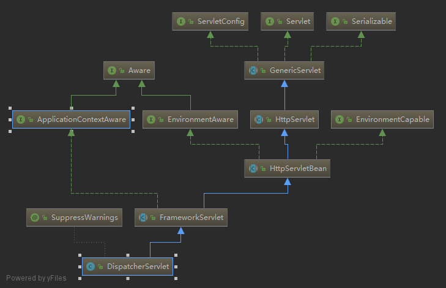

### 关联ApplicationContext  
DispatcherServlet继承ApplicationContextAware接口，通过setApplicationContext方法将Spring的上下文关联到DispatcherServlet中

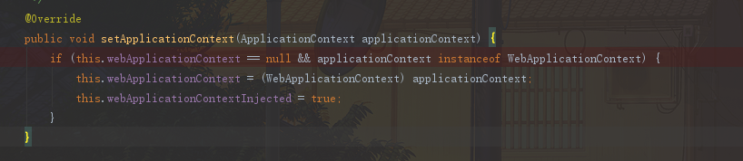

### 初始化 initServletBean  

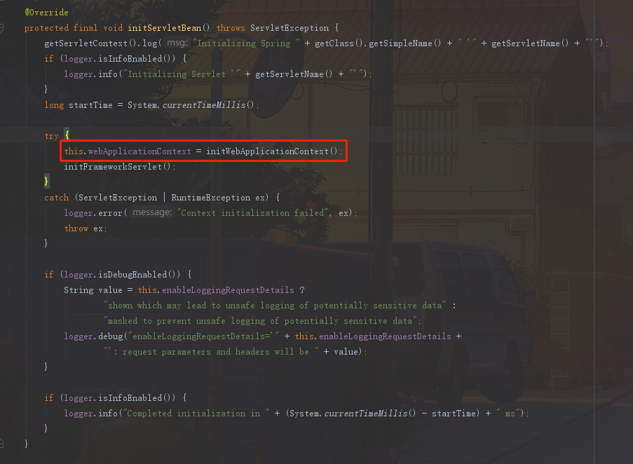

> initWebApplicationContext初始化Web上下文(核心方法)

> initFrameworkServlet方法为扩展方法，默认空实现

* initWebApplicationContext 方法解析

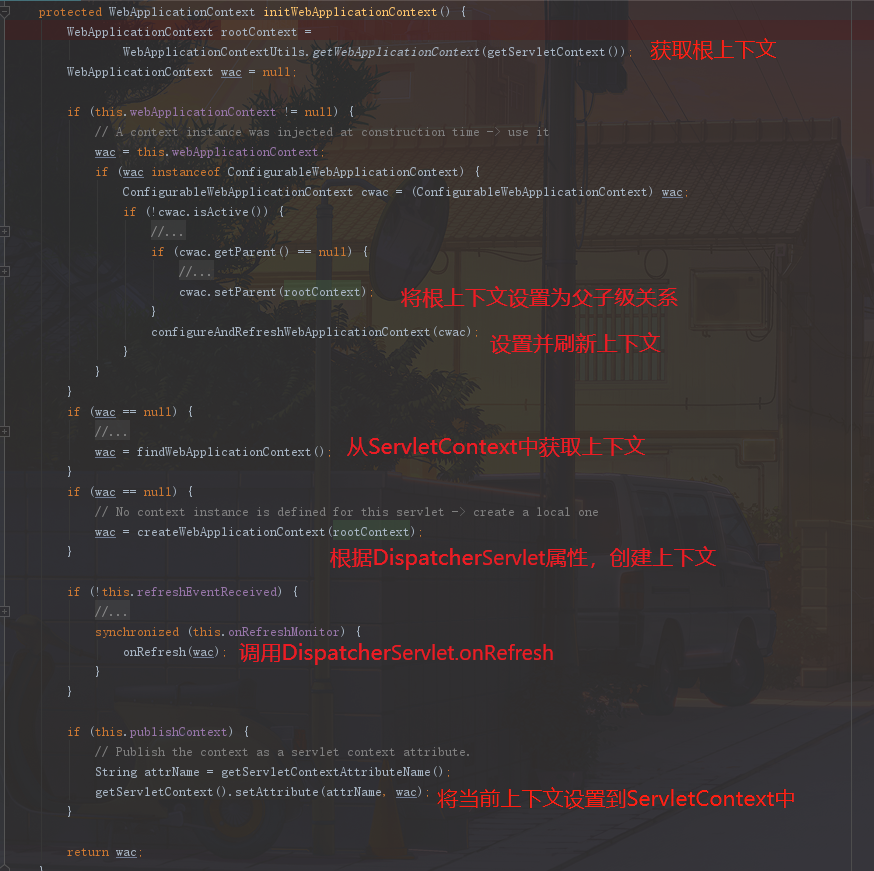

1. 获取rootContext，根上下文由ServletWebServerApplicationContext.prepareWebApplicationContext方法进行设置，将Spring Boot默认上下文设置为根上下文
2. configureAndRefreshWebApplicationContext设置ServletContext,ServletConfig,Environment等参数，而后调用ConfigurableApplicationContext.refresh方法完成上下文初始化

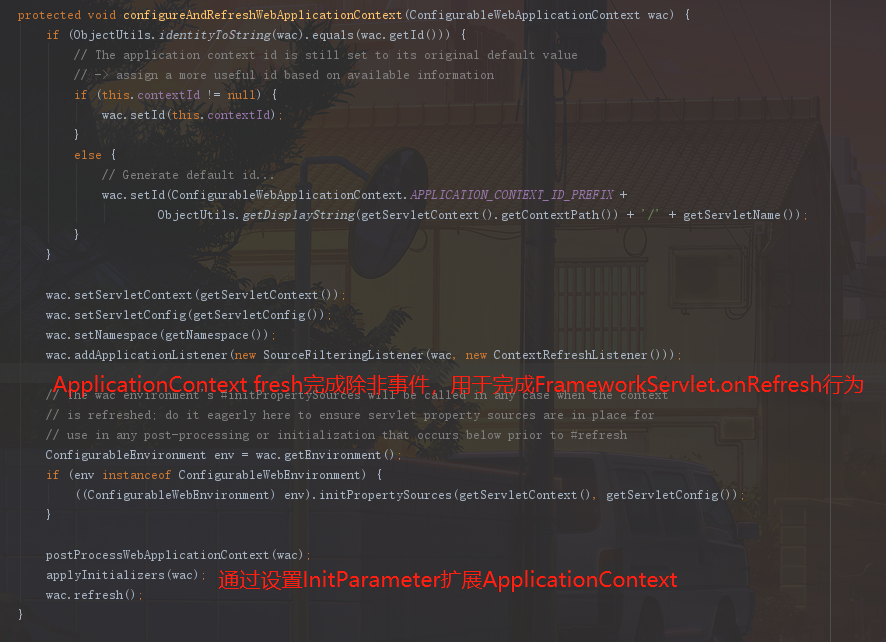

> 其中上下文添加SourceFilteringListener用于监听ApplicationContext完成fresh动作时触发的事件，详情参见AbstractApplicationContext.finishRefresh及FrameworkServlet$ContextRefreshListener

> configureAndRefreshWebApplicationContext方法中调用applyInitializers方法，该方法可通过在Servlet的InitParameter中添加globalInitializerClasses属性，添加org.springframework.context.ApplicationContextInitializer实现类，进行扩展

3. onRefresh

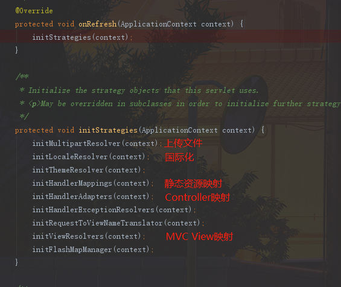

* initMultipartResolver : 初始化文件流解析器，可限制上传文件大小，内存使用大小等。
* initLocaleResolver : 设置国际化语言
* initHandlerMappings : 资源(静态资源/Controller)映射(默认HandlerMapping实例化位于WebMvcConfigurationSupport)(重点)

> RequestMappingHandlerMapping: Controller映射  
> BeanNameUrlHandlerMapping: 配置式Web,根据实例名映射请求路径  
> RouterFunctionMapping: 函数式Web，参考例子: http://zetcode.com/springboot/routerfunction/  
> SimpleUrlHandlerMapping: 静态资源映射  

* initHandlerAdapters : 资源适配，一般Controller适配为RequestMappingHandlerAdapter(重点)
* initHandlerExceptionResolvers: 统一异常处理
* initFlashMapManager : 隐藏参数传递(一般用于重定向)

> 至此初始化完成

### 处理分发请求FrameworkServlet.service->FrameworkServlet.processRequest->DispatcherServlet.doDispatch

> 分发核心逻辑，如图所示:

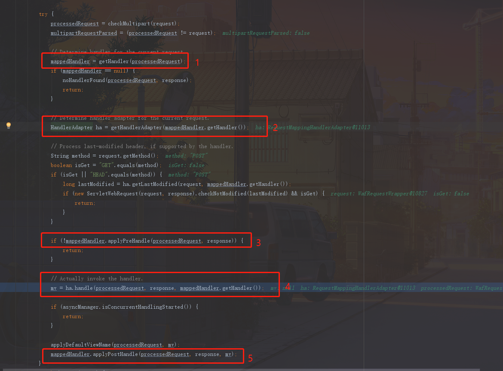

1. 通过processRequest获取对应的Handler，比如login时，会找到LoginController#login方法，并将其封装在HandlerMethod对象中，然后进一步将HandlerMethod与各种拦截器(HandlerInterceptor)装载到HandlerExecutionChain中。

> HandlerExecutionChain

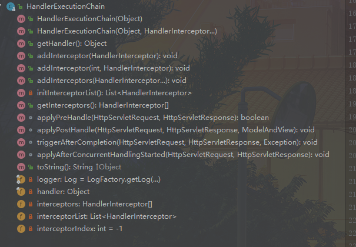 

> applyPreHandle : 处理请求前执行  
> applyPostHandle : 处理请求成功后执行(有异常不执行)  
> triggerAfterCompletion : 处理请求完成后，于applyPostHandle之后执行  

2. 获取Handler适配器

 

> supports方法，判断由哪个适配器处理请求。(个人观点:更像责任链模式)  
> handle方法，动态代理执行请求，比如login请求时，动态代理到LoginController#login  

3. 处理请求前，依次执行拦截器中的applyPreHandle方法

4. 使用适配器处理请求(核心方法)

5. 处理请求后，依次执行拦截器的applyPostHandle方法

### RequestMappingHandlerAdapter 处理请求

> 调用栈 AbstractHandlerMethodAdapter.handle -> RequestMappingHandlerAdapter.handleInternal -> RequestMappingHandlerAdapter.invokeHandlerMethod

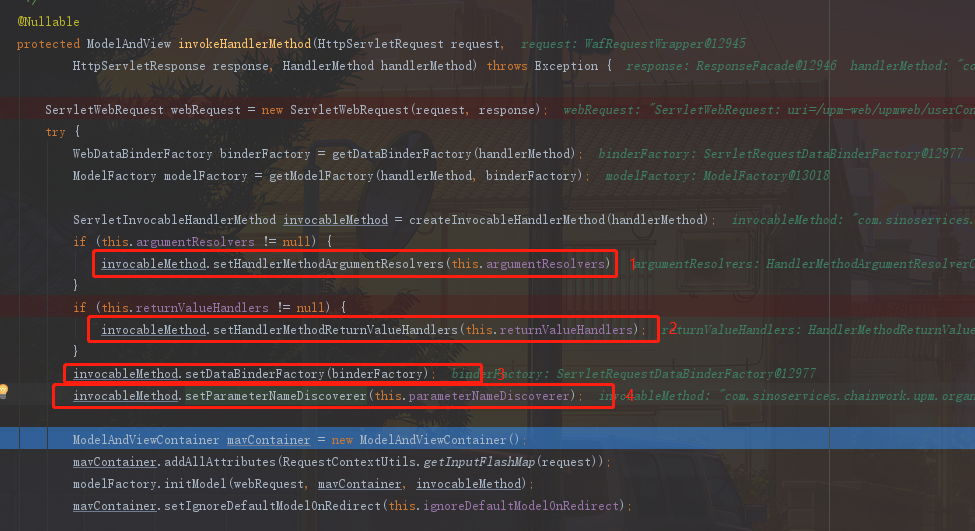 

1. 设置参数转换接口策略(HandlerMethodArgumentResolver)，将request请求转换为Controller方法里面的参数
2. 设置返回值转换接口策略(HandlerMethodReturnValueHandler)，将Controller方法返回值转换为response
3. 设置数据绑定工厂(DataBinderFactory)，将request请求的值绑定到bean对象中
4. 设置参数发现策略(ParameterNameDiscoverer)，获取Controller方法中各个参数名，默认使用jdk1.8反射方式，否则使用asm字节码方式，详见DefaultParameterNameDiscoverer

> jdk1.8 编译时，如果没有添加-parameters参数，则不会将参数名编译进去，而是使用匿名方式，比如arg1,arg2等替换原先参数名

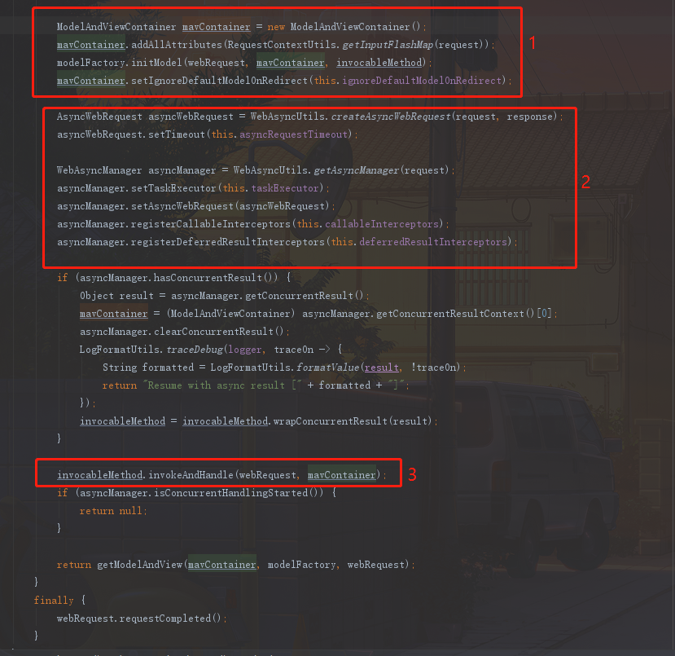 

1. 设置ModelAndView容器，用于传统MVC模式
2. 设置异步请求处理
3. 代理反射调用Controller方法(核心方法)

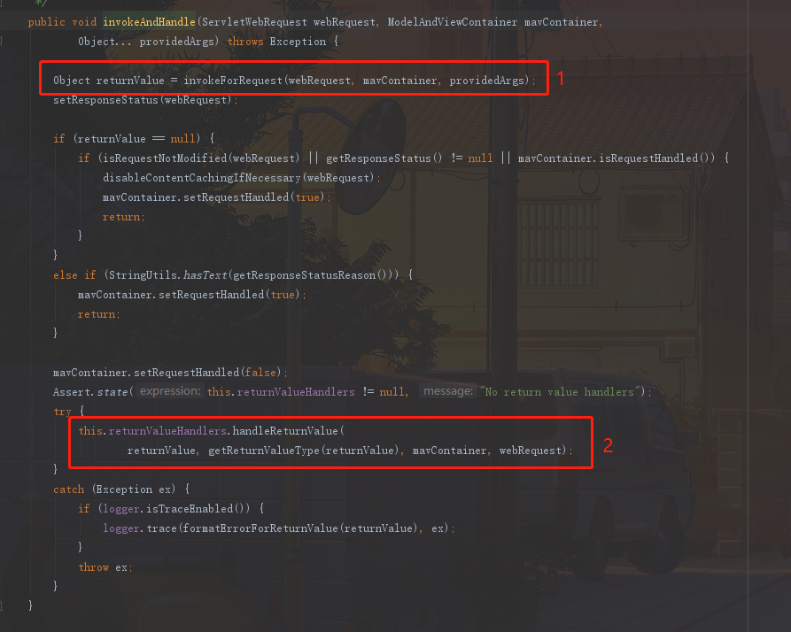 

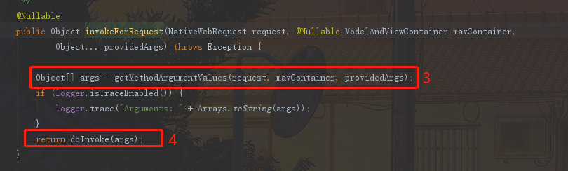 

1. 调用invokeForRequest方法
2. 根据Controller方法返回值写入到response中，比如将对象通过MessageConverter转换为json写入到response中
3. 根据请求，调用上面说的ParameterNameDiscoverer接口以及HandlerMethodArgumentResolver生成Controller方法入参
4. 动态代理反射

> 至此处理请求核心逻辑分析完成，更多细节请自行调试分析

> 本篇旨在向读者展示Spring MVC处理请求时大体流程以及主要类，以便读者更容易读懂相关源码